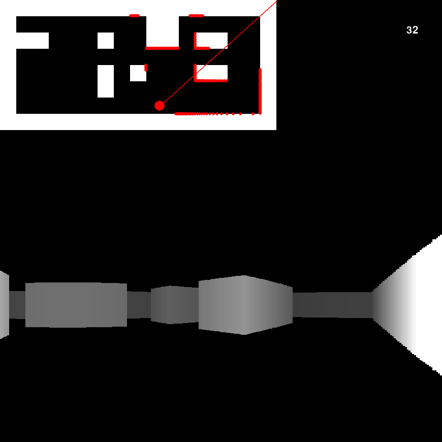

A one evening project inspired by games such as the original 1992 Wolfenstein 3D. The goal was to represent a two dimensionnal top down level in a 3D perspective using raycasting and a 2D graphic engine (in this case, pygame).
This project is only but a POC for myself, as I knew the principles behind the pseudo 3D visuals of Wolfenstein 3D but never tried to implement them myself. No tutorials were followed, so this project may achieve certain results in an unconventionnal way.

A lot of things, from the code structure to controls and optimization could obviously be improved, but the code will probably remain like this for a while, as it wasn't meant to evolve or to be maintainable.

This project uses a version of the [Bresenham's line algorithm](https://en.wikipedia.org/wiki/Bresenham%27s_line_algorithm) to determine when a ray hits a wall. This algorithm is used here in a very overkilled way and would be the first thing that I would tweak if I were to optimize the code.

I planned to refactor the code to do some sort of more readable "V2" of the projet but I ditched it for the moment, as my usage of dataclasses instead of tuples or lists greatly lowered the code performance.

## Controls
    Arrow keys - move the player/camera
    Mouse Wheel - move the player/camera horizontally 
